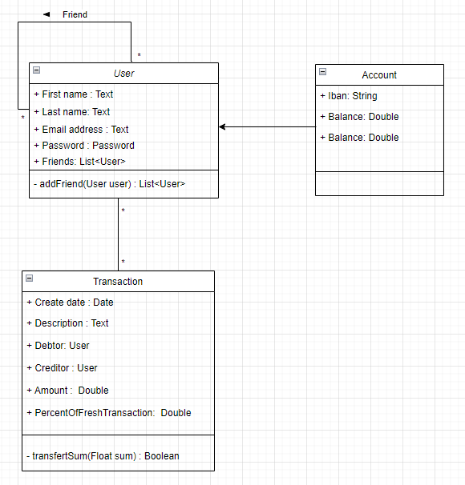
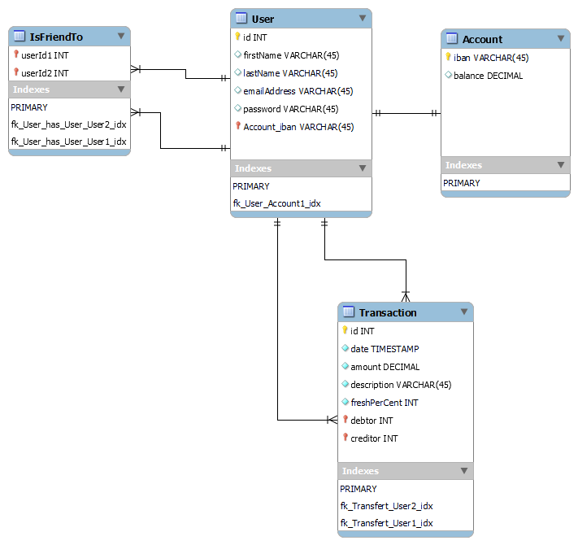
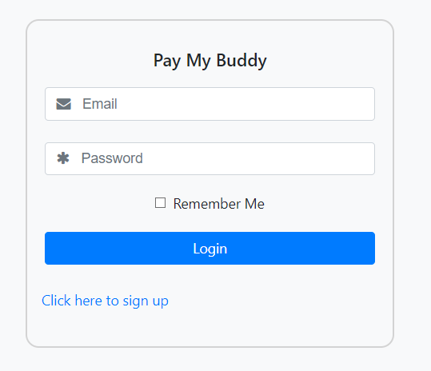
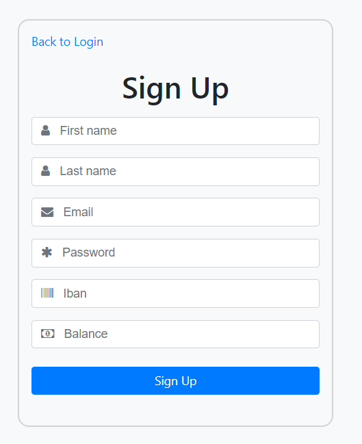
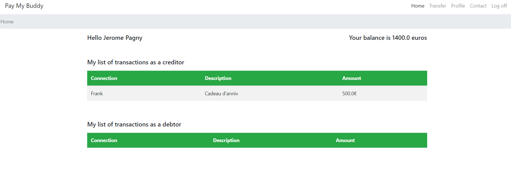
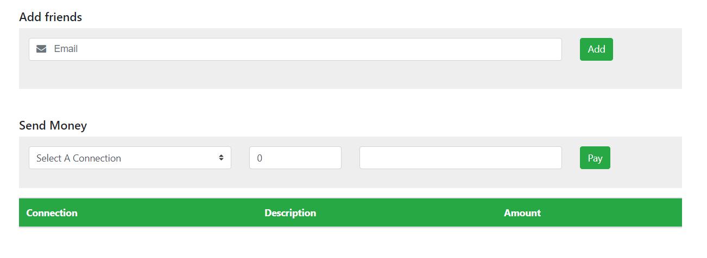
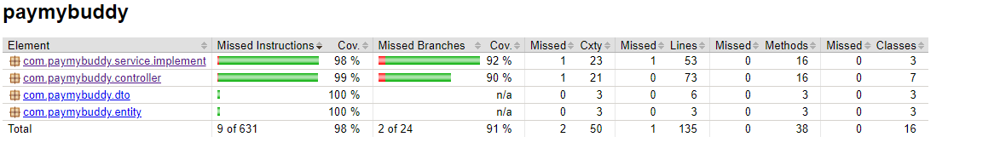

# Pay my buddy

--- 

Une application qui permettrait aux clients de transférer de l'argent pour gérer leurs finances ou payer leurs amis.

--- 

### 1.  Le diagramme de classe UML

### 2. Le modèle physique de données

### 3. Les interfaces web

*login page*

*registration page*

*home page*

*transfer page*

*contact us page*

### 4. Les résultats des tests unitaires & tests intégrations

### 5. Note

1. Pour démarrer l'application, rajouter application.propierties au main / resources

> spring.application.name=paymybuddy
info.app.encoding=UTF-8
server.port=9005
spring.datasource.url=jdbc:mysql://localhost:3306/paymybuddy_prod
spring.datasource.username=root
spring.datasource.password=rootroot
spring.jpa.database-platform = org.hibernate.dialect.MySQL5InnoDBDialect
spring.jpa.generate-ddl=true
spring.jpa.hibernate.ddl-auto = update

2. Pour démarrer les tests, rajouter application.properties au test / resources

> spring.application.name=paymybuddy
info.app.encoding=UTF-8
server.port=9006
spring.datasource.url=jdbc:mysql://localhost:3306/paymybuddy_test
spring.datasource.username=root
spring.datasource.password=rootroot
spring.jpa.database-platform = org.hibernate.dialect.MySQL5InnoDBDialect
spring.jpa.generate-ddl=true
spring.jpa.hibernate.ddl-auto = create
spring.jpa.show-sql=true
spring.jpa.properties.hibernate.format_sql=true
#logging.level.org.springframework=DEBUG
#logging.level.root=DEBUG